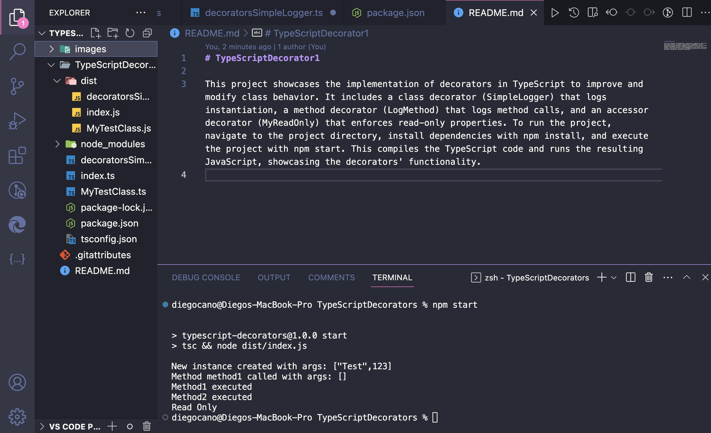

# TypeScriptDecorator1

This project showcases the implementation of decorators in TypeScript to improve and modify class behavior. It includes a class decorator (SimpleLogger) that logs instantiation, a method decorator (LogMethod) that logs method calls, and an accessor decorator (MyReadOnly) that enforces read-only properties. To run the project, navigate to the project directory, install dependencies with npm install, and execute the project with npm start. This compiles the TypeScript code and runs the resulting JavaScript, showcasing the decorators' functionality.

